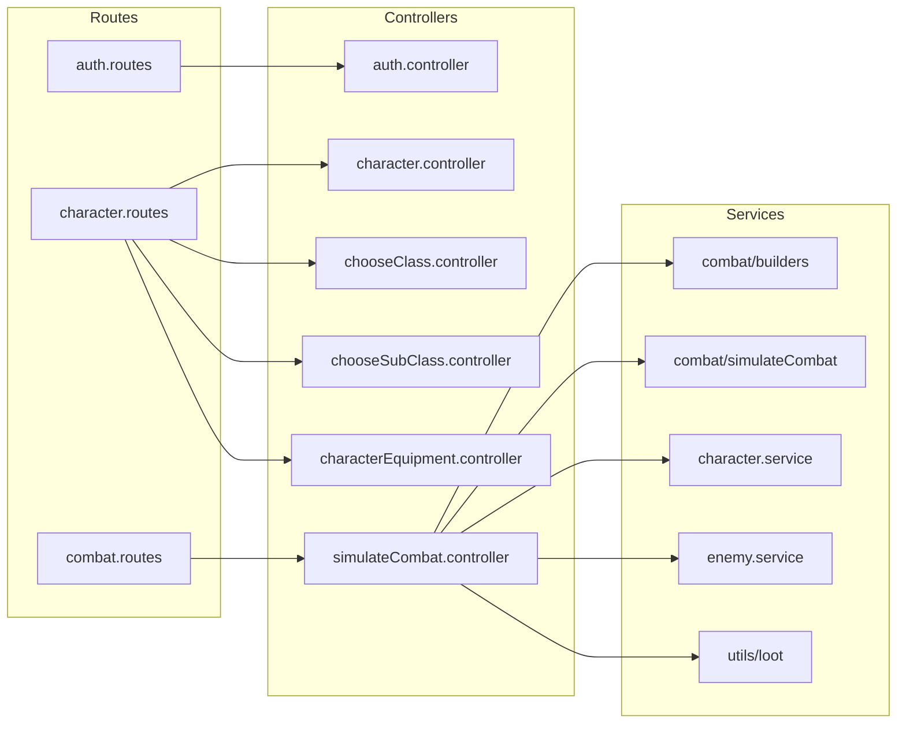
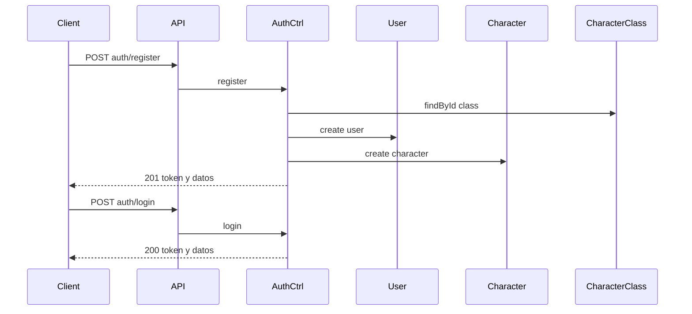
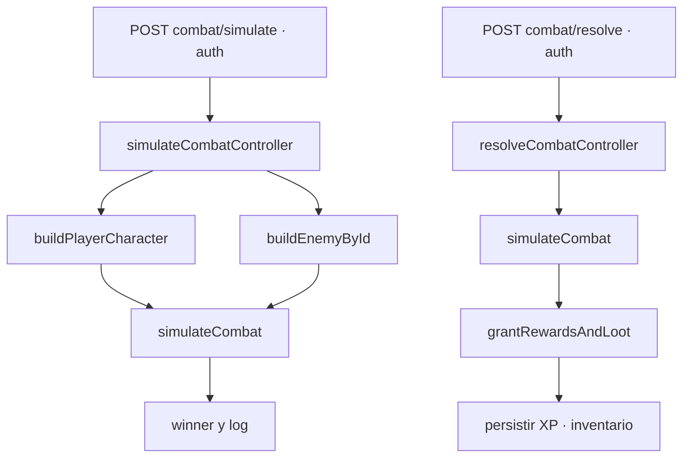
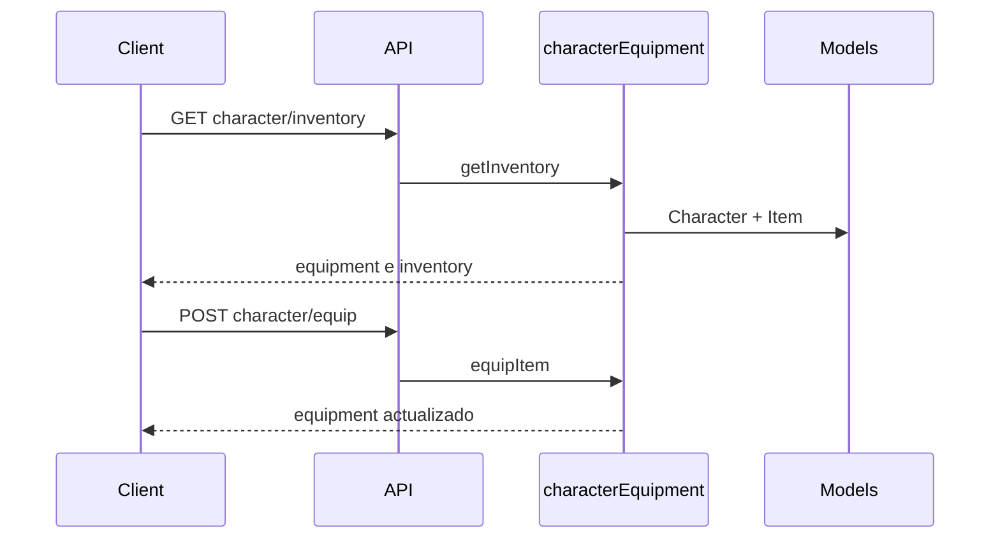
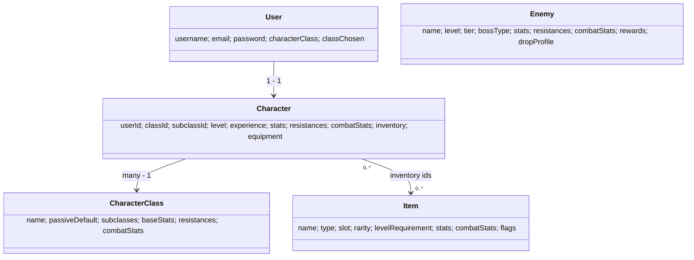
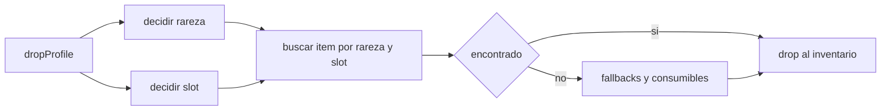

# ⚔️ NOCTHALIS — Backend RPG (Turnos) · Enemigos · Loot

**Autor:** Pablo Serratti — *Todos los derechos reservados.*  
**Aviso:** Nocthalis es una creación original de **Pablo Serratti**. Se prohíbe la copia o uso comercial sin autorización expresa del autor.

---

## 🧭 Índice
- [Qué es Nocthalis](#qué-es-nocthalis)
- [Stack](#stack)
- [Estructura de carpetas](#estructura-de-carpetas)
- [Rutas & Endpoints](#rutas--endpoints)
- [Controladores](#controladores)
- [Modelos](#modelos)
- [Servicios](#servicios)
- [Seeds y scripts](#seeds-y-scripts)
- [Motor de combate](#motor-de-combate)
- [Loot y rarezas](#loot-y-rarezas)
- [Diagramas](#diagramas)
- [Instalación](#instalación)
- [FAQ](#faq)
- [Créditos y derechos](#créditos-y-derechos)

---

## Qué es Nocthalis
Backend de **juego RPG por turnos** con:
- Autenticación, creación de personaje por **clase** y **subclase** (a nivel 10).
- Combate **PvE**: `preview` (sin persistir) y `resolve` (persiste XP/loot).
- Ecosistema de **enemigos** (tiers y bosses), **drop system** con rarezas y 9 **slots** de equipo.
- Inventario y equipamiento completos.

---

## Stack
- **Node.js** + **Express** · **TypeScript**
- **MongoDB** + **Mongoose**
- **JWT** (middleware `requireAuth`)
- **Mermaid** (diagramas en este README)

---

## Estructura de carpetas
```
src/
├─ classes/
│  └─ combat/
│     ├─ PlayerCharacter.ts
│     ├─ EnemyBot.ts
│     ├─ CombatManager.ts
│     └─ Fixtures.ts
│
├─ config/
│  └─ db.ts
│
├─ controllers/
│  ├─ auth.controller.ts
│  ├─ character.controller.ts
│  ├─ characterEquipment.controller.ts
│  ├─ chooseClass.controller.ts
│  ├─ chooseSubClass.controller.ts
│  ├─ getCharacterClasses.controller.ts
│  └─ simulateCombat.controller.ts
│
├─ interfaces/
│  ├─ character/
│  │  ├─ Character.interface.ts
│  │  └─ CharacterClass.interface.ts
│  └─ combat/CombatEntity.ts
│
├─ middleware/requireAuth.ts
│
├─ models/
│  ├─ User.ts
│  ├─ Character.ts
│  ├─ CharacterClass.ts
│  ├─ Item.ts
│  └─ Enemy.ts
│
├─ routes/
│  ├─ auth.routes.ts
│  ├─ character.routes.ts
│  └─ combat.routes.ts
│
├─ scripts/
│  ├─ generateEnemies.ts
│  ├─ resetDb.ts
│  ├─ seedCharacterClasses.ts
│  ├─ seedItems.ts
│  └─ testBuilders.ts
│
├─ services/
│  ├─ combat/builders.ts
│  ├─ combat/simulateCombat.ts
│  ├─ character.service.ts
│  ├─ enemy.service.ts
│  └─ subclass.service.ts
│
├─ types/lean.ts
└─ utils/loot.ts
```

---

## Rutas & Endpoints

**Auth (`auth.routes.ts`)**
- `POST /auth/register`
- `POST /auth/login`

**Character (`character.routes.ts`)**
- `GET /character/classes`
- `POST /character/choose-class` *(auth)*
- `POST /character/choose-subclass` *(auth)*
- `GET /character/me` *(auth)*
- `GET /character/inventory` *(auth)*
- `POST /character/equip` *(auth)*
- `POST /character/unequip` *(auth)*
- `POST /character/use-item` *(auth)*
- `GET /character/progression` *(auth)*

**Combat (`combat.routes.ts`)**
- `GET /combat/simulate` *(fixtures, sin auth)*
- `POST /combat/simulate` *(auth, no persiste)*
- `POST /combat/resolve` *(auth, persiste XP + loot)*

---

## Controladores (resumen)
- **auth.controller.ts** → `register`, `login` (transacción al registrar: User + Character).
- **character.controller.ts** → `getMyCharacter` (incluye clase y subclase si existe).
- **characterEquipment.controller.ts** → `getInventory`, `equipItem`, `unequipItem`, `useConsumable`, `getProgression` (valida slots y nivel).
- **chooseClass.controller.ts** → `chooseClass` (evita duplicados y crea personaje).
- **chooseSubClass.controller.ts** → `chooseSubclass` (nivel mínimo 10).
- **getCharacterClasses.controller.ts** → catálogo de clases/subclases.
- **simulateCombat.controller.ts** → `preview fixtures`, `preview real`, `resolve` (con `grantRewardsAndLoot`).

---

## Modelos
- **User**: `username`, `email`, `password`, `characterClass: ObjectId | null`, `classChosen: boolean` (virtual `id`).
- **Character**: `userId`, `classId`, `subclassId`, `level`, `experience`, `stats`, `resistances`, `combatStats`, `inventory: string[]`, `equipment` (9 slots). Defaults y virtual `id`.
- **CharacterClass**: `name`, `description`, `iconName`, `imageMainClassUrl`, `passiveDefault`, `subclasses[]`, `baseStats`, `resistances`, `combatStats` (virtual `id`).
- **Item**: `type`, `slot`, `rarity`, `stats`, `combatStats`, `levelRequirement`, flags (`isConsumable`, `isUnique`, etc.) (virtual `id`).
- **Enemy**: `name`, `level`, `tier`, `bossType?`, `stats`, `resistances`, `combatStats`, `xpReward`, `goldReward`, `dropProfile` (normalizaciones y `powerScore`).

---

## Servicios
- **combat/builders.ts** → `buildPlayerCharacter(id)`, `buildEnemyById(id)` (completa defaults y devuelve clases POO).
- **combat/simulateCombat.ts** → adapta al `CombatManager` en modos `fixtures`, `real-preview`, `real`.
- **character.service.ts** → `findCharacterById`, `grantRewardsAndLoot` (aplica XP/nivel y agrega drops al inventario).
- **enemy.service.ts** → `findEnemyByIdLean`.
- **subclass.service.ts** → helpers para recuperar subclases embebidas.

---

## Seeds y scripts
- **generateEnemies.ts**: 50 enemigos exactos (3 por nivel 1..15) + miniboss (4,8,12) + boss (10,15). RNG determinístico, arquetipos, resistencias por banda, `dropProfile` y recompensas.
- **seedItems.ts**: catálogo por **slot × tramo de nivel × rareza** (Novato 1–5, Veterano 6–10, Maestro 11–15) + consumibles y materiales.
- **seedCharacterClasses.ts**: Guerrero, Mago, Asesino, Arquero (con pasivas y subclases).
- **resetDb.ts**: limpia colecciones, sincroniza índices e inserta seeds (bloquea en producción).
- **testBuilders.ts**: smoke test de builders.

---

## Motor de combate
- **PlayerCharacter / EnemyBot** implementan `CombatEntity` (HP y daño directo, método `isAlive`).
- **CombatManager**:
  - Daño: `floor(attackPower * (1 - damageReduction/100))`.
  - Turnos: Player → Enemy (hasta 200 rondas o muerte).
  - Devuelve `winner`, `turns`, `log[]` legible.

---

## Loot y rarezas
- Cada enemigo tiene `dropProfile` con:
  - `rolls`, `rarityChances`, `slotWeights`, `guaranteedMinRarity?`.
- Distribución típica no-boss: common 60–70, uncommon 25–35, rare 5–12, epic 0–6, legendary 0–1.
- Boss ajusta hacia `rare/epic/legendary` y sube `rolls`.
- **utils/loot.ts (stub actual)**: toma 0–2 ítems al azar del catálogo (útil para pruebas).

---

## Diagramas

### 1) Arquitectura (Rutas → Controladores → Servicios)


### 2) Auth + Registro / Login


### 3) PvE: Simulación vs Resolución


### 4) Inventario y Equipo


### 5) Relación de Modelos


### 6) Pipeline de Loot


---

## Instalación
1. **Instalar dependencias**
   ```bash
   npm install
   ```
2. **Configurar `.env`**
   ```
   PORT=3030
   JWT_SECRET=clave
   MONGO_URI=mongodb+srv://...
   NODE_ENV=development
   ```
3. **Poblar base (DEV)**
   ```bash
   npm run reset-db
   ```
4. **Correr en desarrollo**
   ```bash
   npm run dev
   ```

---

## FAQ
**¿Qué diferencia hay entre simulate y resolve?**  
`simulate` no persiste; `resolve` guarda XP y loot.

**¿Cuándo puedo elegir subclase?**  
A partir del **nivel 10**.

**No me deja equipar un ítem.**  
Revisa `levelRequirement` y que el `slot` sea válido para ese ítem.

**¿De dónde salen los drops?**  
De `dropProfile` del enemigo. El `roller` actual es un **stub** que devuelve hasta 2 ítems aleatorios del catálogo.

**¿Es seguro ejecutar resetDb?**  
Solo en **desarrollo**: en producción aborta por seguridad.

---

## Créditos y derechos
**Nocthalis** fue creado por **Pablo Serratti**.  
© 2025 Pablo Serratti. *Todos los derechos reservados.*
