# ⚔️ NOCTHALIS — Backend RPG (Turnos)

> API de juego RPG por turnos con **PvP**, **enemigos**, **loot** y progresión.  
> El motor de combate vive en `src/battleSystem/` (README propio con más detalle).

---

## 🧭 Índice

- [TL;DR / Features](#tldr--features)
- [Stack](#stack)
- [Estructura](#estructura)
- [Rutas de API](#rutas-de-api)
- [Flujo PvP](#flujo-pvp)
- [Motor de combate](#motor-de-combate)
- [Modelos (resumen)](#modelos-resumen)
- [Seeds & Scripts](#seeds--scripts)
- [Instalación / Dev](#instalación--dev)
- [FAQ](#faq)
- [Créditos](#créditos)

---

## TL;DR / Features

- Registro/Login (JWT).
- Personaje con **clase** (y **subclase** a nivel 10).
- **PvP** con _match seed_, timeline, snapshots y **consumo de Stamina** al resolver.
- **PvE** y _fixtures_ listos para pruebas.
- **Sistema de ítems** (9 slots), rarezas y catálogo seed.
- **Enemigos** generados por nivel/arquetipo, _drop profile_ y recompensas.
- Código 100% **TypeScript** + **Mongoose**.

---

## Stack

- **Node + Express + TypeScript**
- **MongoDB + Mongoose**
- **JWT** (middleware `requireAuth`)
- Diagramas **Mermaid** en los README

---

## Estructura

```
src/
├─ battleSystem/        # Motor de combate (PvP/PvE, armas, RNG, hooks, UI helpers)
│  ├─ core/             # Manager, snapshot, RNG, weapons, status engine
│  ├─ pvp/              # pvpRunner (timeline/log/snapshots)
│  ├─ ui/               # animationScheduler (a partir del timeline)
│  └─ README.md         # ▶ Detalle técnico del motor (ver)
│
├─ controllers/         # Auth, Character, Combat, Arena, Stamina, etc.
├─ routes/              # /api/* endpoints (auth, character, combat, arena, stamina)
├─ models/              # User, Character, CharacterClass, Item, Enemy, Match, CombatResult
├─ scripts/             # resetDb, seeds, generateEnemies, testBuilders
└─ services/            # progression, stamina, etc.
```

> 📖 **Motor de combate (documentación ampliada):**  
> `src/battleSystem/README.md`

---

## Rutas de API

Prefijo base en `src/index.ts`:

- `/api/auth/*` (auth)
- `/api/*` (character, combat, arena)
- `/api/stamina/*` (stamina)

### Auth

- `POST /api/auth/register`
- `POST /api/auth/login`

### Character

- `GET  /api/character/classes`
- `POST /api/character/choose-class` _(auth)_
- `POST /api/character/choose-subclass` _(auth)_
- `GET  /api/character/me` _(auth)_
- `GET  /api/character/progression` _(auth)_
- `GET  /api/character/inventory` _(auth)_
- `POST /api/character/equip` _(auth)_
- `POST /api/character/unequip` _(auth)_
- `POST /api/character/use-item` _(auth)_
- `POST /api/character/allocate` _(auth)_

### Arena (PvP)

- `GET  /api/arena/opponents` _(auth)_
- `POST /api/arena/challenges` _(auth)_ → crea **Match** `pending` con snapshots

### Combat

- `GET  /api/combat/simulate` _(fixtures, sin auth)_
- `POST /api/combat/simulate` _(auth, preview real; NO persiste)_
- `POST /api/combat/resolve` _(auth, PERSISTE; cobra Stamina, aplica recompensas)_
- `GET  /api/combat/results` _(auth)_
- `GET  /api/combat/results/:id` _(auth)_

### Stamina

- `GET  /api/stamina/` _(auth)_ → snapshot de Stamina
- `POST /api/stamina/use` _(auth)_ → gasto genérico
- `POST /api/stamina/admin/set` _(auth)_ → ajuste admin

> **Nota:** el costo actual de **PvP resolve** está en el controlador: `STAMINA_COST_PVP = 10`.

---

## Flujo PvP

```mermaid
sequenceDiagram
  participant Client
  participant API
  participant Arena as ArenaCtrl
  participant Combat as CombatCtrl
  participant DB as Mongo

  Client->>API: GET /api/arena/opponents (auth)
  API->>Arena: getArenaOpponents
  Arena->>DB: Character (+ clase)
  Arena-->>Client: lista rivales

  Client->>API: POST /api/arena/challenges { opponentId }
  API->>Arena: postArenaChallenge
  Arena->>DB: Character atacante/defensor + Class
  Arena->>DB: buildCharacterSnapshot()
  Arena->>DB: Match.create(pending, seed, snapshots)
  Arena-->>Client: matchId, seed, status

  Client->>API: POST /api/combat/simulate { matchId } (auth)
  API->>Combat: simulateCombat (NO persiste)
  Combat-->>Client: outcome, timeline, log, snapshots

  Client->>API: POST /api/combat/resolve { matchId } (auth)
  API->>Combat: resolveCombat (cobra Stamina)
  Combat->>DB: runPvp → normaliza timeline → aplica rewards
  Combat->>DB: Match.update(resolved)
  Combat-->>Client: outcome, rewards, staminaAfter, timeline
```



---

## Motor de combate

- **Runner PvP** (`src/battleSystem/pvp/pvpRunner.ts`)
  - Soporta **passive_proc** y **ultimate_cast** (events en timeline).
  - **Tags** (arma usada, crit, miss, block, pasiva/ultimate, hooks de clase).
  - **Snapshots** por impacto (para UI/animaciones).
  - **Sin arma**: se tolera; el runner usa `ensureWeaponOrDefault` (puños o `defaultWeapon` de la clase).
- **Animation scheduler** (`src/battleSystem/ui/animationScheduler.ts`)  
  Genera eventos con timestamps a partir del timeline (`windup`, `impact_*`, `passive_proc`, `ultimate_cast`).

> Detalles, tipos y ejemplos → ver **`src/battleSystem/README.md`**.

---

## Modelos (resumen)


---

## Seeds & Scripts

- `npm run reset-db` → limpia colecciones, sincroniza índices, **inserta**:
  - **Clases** (`seedCharacterClasses.ts`) con pasiva/ultimate/armas primarias y `defaultWeapon`.
  - **Ítems** (`seedItems.ts`) por **slot × tramo de nivel × rareza** (+ consumibles/materiales).
  - **Enemigos** (`generateEnemies.ts`): 50 exactos (3×nivel 1..15 + miniboss 4/8/12 + boss 10/15).
- `scripts/testBuilders.ts` → smoke test de _builders_ (IDs opcionales).

---

## Instalación / Dev

1. Dependencias

```bash
npm install
```

2. `.env`

```
PORT=3030
JWT_SECRET=supersecreto
MONGO_URI=mongodb+srv://...
NODE_ENV=development
```

3. Poblar base (DEV)

```bash
npm run reset-db
```

4. Levantar API

```bash
npm run dev
```

---

## FAQ

**¿Simulate vs Resolve?**  
`simulate` no persiste (preview). `resolve` cobra **Stamina**, guarda **Match** resuelto, aplica XP/oro/honor.

**¿Y si el personaje no tiene arma?**  
El runner usa **arma por defecto** de la clase o **puños**, sin romper el combate.

**¿Subclases?**  
Disponibles al **nivel 10** (endpoint `/character/choose-subclass`).

**¿Estados (burn/stun/poison)?**  
Hay **engine** listo (`StatusEngine`) y eventos reservados; los proc/resistencias se integran progresivamente.

---

## Créditos

**Nocthalis** — © 2025 Pablo Serratti.  
Motor y backend en TypeScript/Mongo.

> Documentación ampliada del combate: **`src/battleSystem/README.md`**.
