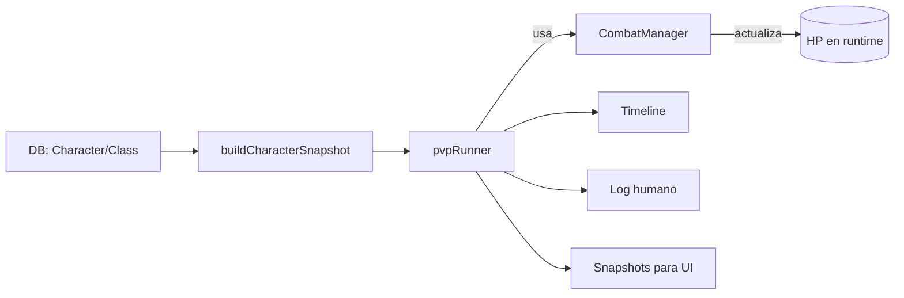
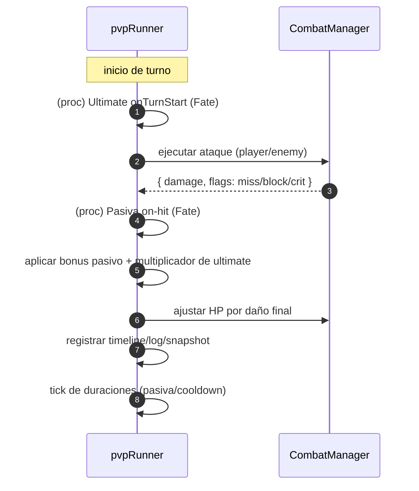

# Battle System (PvP‑first)

Módulo encargado de **toda la lógica de combate** para _Nocthalis_. Está diseñado para ser **modular**, **determinista** (por seed) y fácil de extender con pasivas, estados y armas.

> **Estado actual**: PvP funcional 100% (impactos alternados, críticos/bloqueos/evades, pasiva simple y ultimate con proc por "Fate"), listo para UI con _timeline_ y _snapshots_. PvE/estados con efecto numérico llegarán después.

---

## 📁 Estructura de carpetas

```
src/battleSystem/
├─ core/                # Motor base
│  ├─ CombatManager.ts  # Calcula golpe: daño, miss, block, crit; aplica HP
│  ├─ CharacterSnapshot.ts  # Normaliza un personaje/enemigo a "snapshot"
│  ├─ StatusEngine.ts   # Estados (stacks/duración) – hoy sólo registra eventos
│  ├─ Weapon.ts         # Normalización de armas y defaults (incluye "fists")
│  ├─ RngFightSeed.ts   # PRNG determinista (mulberry32)
│  └─ Builders.ts       # Helpers DEV para instanciar Player/Enemy desde DB
│
├─ pvp/
│  └─ pvpRunner.ts      # Runner canónico: orquesta turnos y emite timeline
│
├─ passives/
│  ├─ ClassPacks.ts     # Hooks por clase (tags para VFX/logs)
│  ├─ PassiveEffects.ts # Suma modificadores flat a stats/combat (opcional)
│  └─ DefaultPassives.ts# Cobertura simple por clase (opcional)
│
├─ ui/
│  └─ animationScheduler.ts # De timeline → timeline "animable" (con timestamps)
│
├─ constants/           # Coefs de asignación y resistencias base
└─ fixtures/            # Datos de prueba (dev-only)
```

---

## 🧠 Conceptos clave

- **Determinismo por seed**: todos los combates se reproducen con `seed` fijo (mulberry32).
- **Snapshots inmutables**: el runner NO toca la DB; opera sobre _snapshots_ congelados.
- **Weapons opcionales**: si un jugador **no tiene arma**, se aplican **defaults**:
  - `ensureWeaponOrDefault()` usa `class.defaultWeapon` y, como último fallback, `"fists"`.
  - Los escudos en _offhand_ añaden un **pequeño bonus** (block +5%, DR +3%).
- **Skills de clase (opcionales)**: pasiva simple y ultimate con proc ligado a _Fate_.
- **Timeline enriquecido**: cada evento de golpe trae tags (arma usada, crit, miss, passive/ultimate, hooks de clase) para la capa de UI.

---

## 🔁 Flujo de datos



**Dónde entra la UI**:

- `/pvp/pvpRunner.ts` → `timeline`, `log`, `snapshots`.
- `/ui/animationScheduler.ts` convierte el timeline en **eventos con timestamps** para animar.

---

## 🧩 Runner PvP (resumen)

```ts
import { runPvp } from "@/battleSystem";
const { outcome, turns, timeline, log, snapshots } = runPvp({
  attackerSnapshot,
  defenderSnapshot,
  seed: 12345,
  maxRounds: 30,
});
```

**Salida**

- `outcome`: `"win" | "lose" | "draw"` (para el atacante)
- `turns`: **cantidad de impactos** (no cuenta eventos de habilidades)
- `timeline`: lista ordenada de eventos
- `log`: líneas legibles para consola/depuración
- `snapshots`: estado breve por golpe (HP, tags, pendientes de status)

**Eventos del timeline**

- `hit | crit | block | miss | passive_proc | ultimate_cast`

**Tags útiles (ejemplos)**

- `player:weapon:sword_iron` · `player:crit` · `enemy:blocked`
- `player:passive:Infusión Arcana` · `enemy:ultimate`
- Hooks de clase: `player:class:warrior:onRoundStart`, etc.

---

## ⚙️ Cálculos por turno (alto nivel)



> **Nota**: los _ClassPacks_ hoy sólo emiten **tags** (no modifican números). El `StatusEngine` administra stacks/duración y emite eventos, pero aún no altera el cálculo de daño/turnos.

---

## 📦 API pública relevante

### `runPvp()`

- Entrada: `{ attackerSnapshot, defenderSnapshot, seed, maxRounds? }`
- Salida: `{ outcome, turns, timeline, log, snapshots }`

### `runPvpForMatch()`

- Mapea `outcome` a contrato de `Match` (`attacker|defender|draw`) y adapta el timeline.

### `buildAnimationSchedule(timeline, opts?)`

- Convierte el _timeline_ en **eventos con timestamps** (windup/impact/skills) para la UI.

---

## 🔌 Integración con backend

- **Preview**: `GET /api/combat/simulate` (sandbox público para dev) y `POST /api/combat/simulate` (auth, no persiste).
- **Resolución**: `POST /api/combat/resolve` (auth) → cobra stamina, persiste `Match` + `CombatResult` y aplica recompensas.
- **Arena**: `GET /api/arena/opponents`, `POST /api/arena/challenges` → crea `Match` con snapshots congelados.

> **runnerVersion**: subir si se cambia la semántica del runner. El resolve guarda la versión usada.

---

## 🔧 Extensión rápida

- **Armas**: agrega tipos o defaults en `core/Weapon.ts`.
- **Pasivas de clase**: define packs en `passives/ClassPacks.ts` (hooks `onRoundStart`, `onModifyOutgoing`, `onModifyIncoming` → hoy sólo tags).
- **Skills Fate-driven** (opcional, desde _snapshot.class_):

```ts
passiveDefaultSkill?: {
  enabled?: boolean;
  name: string;
  trigger: { check: "onBasicHit"; baseChancePercent?: number; fateScalePerPoint?: number; maxChancePercent?: number };
  durationTurns?: number;
  bonusDamage?: number; // flat
};

ultimateSkill?: {
  enabled?: boolean;
  name: string;
  cooldownTurns: number;
  effects?: { bonusDamagePercent?: number; applyDebuff?: string; debuffDurationTurns?: number; debuffValue?: number };
  proc?: { enabled?: boolean; respectCooldown?: boolean; trigger?: { check: "onTurnStart"; baseChancePercent?: number; fateScalePerPoint?: number; maxChancePercent?: number } };
};
```

---

## 🧪 Utilidades DEV

- `scripts/resetDb.ts` → limpia colecciones y hace seeds (clases, items, enemigos).
- `scripts/seedItems.ts` → catálogo dinámico (todo entero/basis points).
- `scripts/generateEnemies.ts` → 50 enemigos (1..15 con miniboss/boss) deterministas.
- `scripts/testBuilder.ts` → prueba _builders_ y muestra resumen (IDs por CLI/env).

---

## 📝 Decisiones & gotchas

- **`turns`** en PvP = **impactos** (no cuenta `passive_proc`/`ultimate_cast`).
- **Sin maná**: no se usa `maxMP`; pociones de vida sí.
- **Offhand**: aún no se procesa daño dual; los escudos dan bonus defensivo pequeño.
- **Status**: registrados para UI; la aplicación numérica llegará en la siguiente iteración.

---

## 📌 TODO (próximas iteraciones)

- Aplicación numérica de estados (bleed/poison/stun) desde `StatusEngine`.
- Offhand con daño/efectos (dagas/quiver/focus) y sinergias con clase.
- PvE loop (IA simple, loot y progresión) usando `generateEnemies` y `seedItems`.
- Más hooks de clase y _affixes_ de ítems integrados al daño real.
